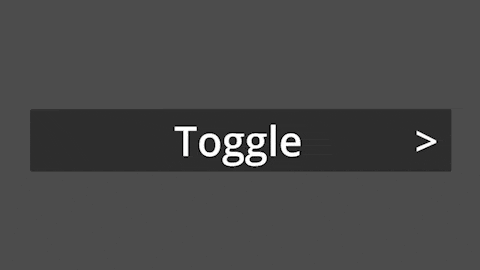

#  CollapsibleContainer

<p align="center">
  
</p>

## A Godot plugin node capable of expanding and collapsing.

A custom node for the Godot Game Engine that can help with many of your expanding/collapsing UI needs. It was initially made to mimic an [accordion UI](https://en.wikipedia.org/wiki/Accordion_(GUI)) element.

  
  
  ## Table of contents
* [Node Information](#node-information)
* [Known Issues](#known-issues)
* [Tutorial video](#basic-tutorial-video)
* [Installation](#installation)
* [Contribute](#contribute)
* [Donate](#donate)

## Node Information
* Any `Control` nodes childed to the `Collapsible` can be hidden and revealed.
* The folding and unfolding can be previewed directly in the editor!
* The size it expands to or collapses to can be customized, but it can automatically it's 'open size' to match the `Control` node you want to hide/reveal.
* Easing functions can be used to open/close, with customizable tween transition types and ease types.
* The direction the `Collapsible` opens/closes can be customized (e.g., top, bottom, left, right, top-bottom, etc.).
* The dimension the `Collapsible` opens/closes can be customized (e.g., width, height, both).
* This node has comprehensive documentation. Just like with built-in nodes, you can utilize the documentation from within the Godot editor to quickly find and understand relevant functions.

## Known Issues
* Fixed in Godot Version 4.5: in debug builds, selecting the CollapsibleContainer through the remote scene tree will print out 2 errors in the console each time (nothing breaks: just error logs).
  * Godot Issue: https://github.com/godotengine/godot/issues/108164

## Basic Tutorial

Tutorial video going over the basics of the `CollapsibleContainer` node: <https://youtu.be/o2qTSv0QmKA>

<details open>
  <summary><h4>Usage Script</h4></summary>

* This script and a more detailed usage script is provided in this plugin's documentation within Godot.

```GD
func _ready() -> void:
  var collapsible := CollapsibleContainer.new()
  
  # Create button to toggle the collapsible
  var button := Button.new()
  button.set_text("Collapsible Button")
  button.connect("pressed", collapsible.open_tween_toggle) # Connect signal to collapsible
  add_child(button)
  
  # Create and child node you want to collapse.
  var label := Label.new()
  label.set_text("Hide Me!")
  collapsible.add_child(label)
  
  # Add collapsible to scene with custom settings.
  add_child(collapsible)
  collapsible.set_sizing_node_path(label.get_path())
  collapsible.set_folding_direction_preset(CollapsibleContainer.FoldingPreset.PRESET_TOP_WIDE)
  collapsible.set_anchors_and_offsets_preset(Control.PRESET_CENTER)
```
</details>

## Installation

You can install the plugin from within Godot's AssetLib tab! Remember to enable it in Project Settings!

Official Godot guide to installing plugins: <https://docs.godotengine.org/en/stable/tutorials/plugins/editor/installing_plugins.html>

Video guide to install a release from GitHub: <https://youtu.be/JRsGAgpPV8U>
 
<details close>
  <summary><h4>Written Step-By-Step Guide to Install a Release from GitHub</h4></summary>
  
  1. In the [releases section](https://github.com/ArshvirGoraya/Godot-Collapsible-Container/releases), find the release which corresponds with your Godot version. If a Godot version is not listed, this plugin likely does not work in that Godot version.
  2. Download the .zip file from the release which corresponds with your Godot version.
  3. Open your Godot project.
  4. Unzip the "addons" folder from the downloaded .zip file into the project's "res://" directory.
  5. Enable the plugin: Projects -> Project Settings -> Plugins -> Click enable on the CollapsibleContainer plugin.
  6. Done! You can now add the CollapsibleContainer node into your scene tree.
</details>

## Contribute
**Bug/Feedback**: Submit an issue using the issues tab after ensuring that it won't be a duplicate.

**Pull requests**: The main tool script (and even the example projects) are all documented. This includes every function. For complicated functions, this may even include every line in that function. Hopefully this makes it easier to understand and contribute to the project.

## Donate
<p align="center">
  <a href='https://ko-fi.com/Z8Z6NP272' target='_blank'></a>
  <a href='https://www.paypal.com/donate/?hosted_button_id=6898PNAVV5QRC' target='_blank'></a>
  <a href='https://github.com/sponsors/ArshvirGoraya' target='_blank'></a>
</p>
